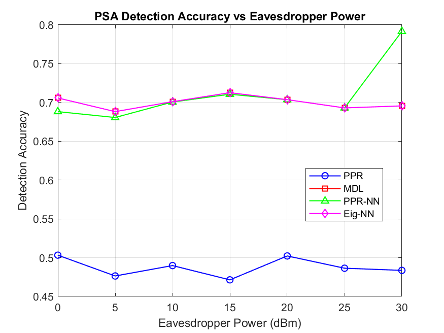
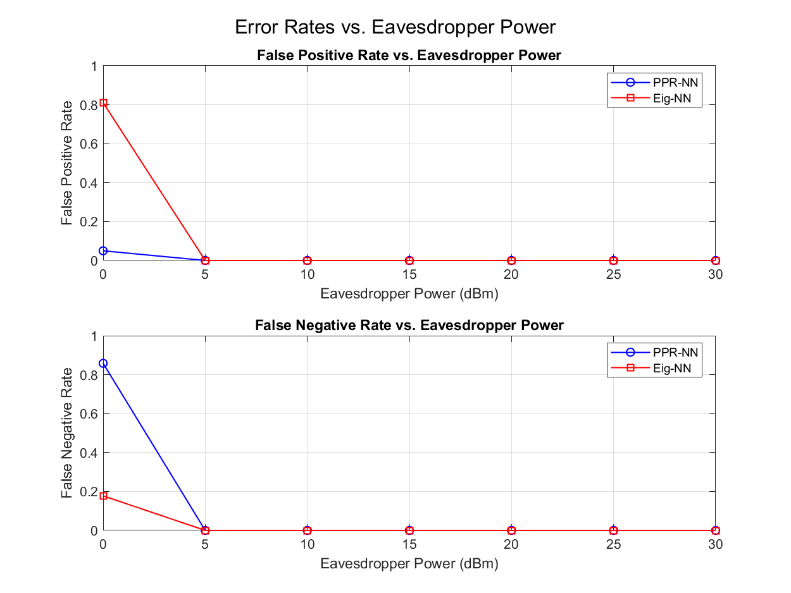
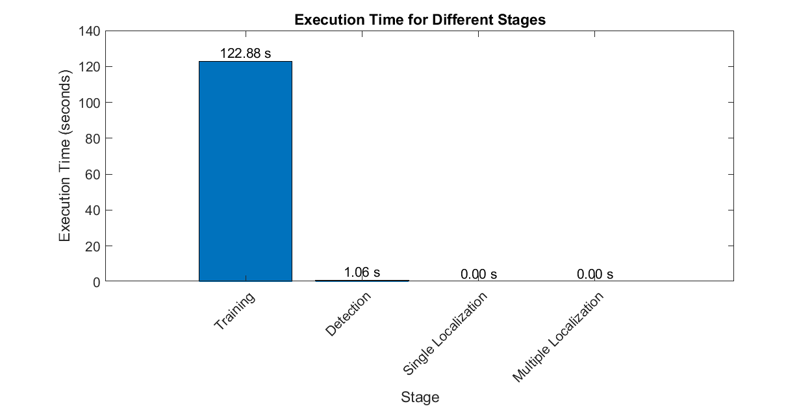
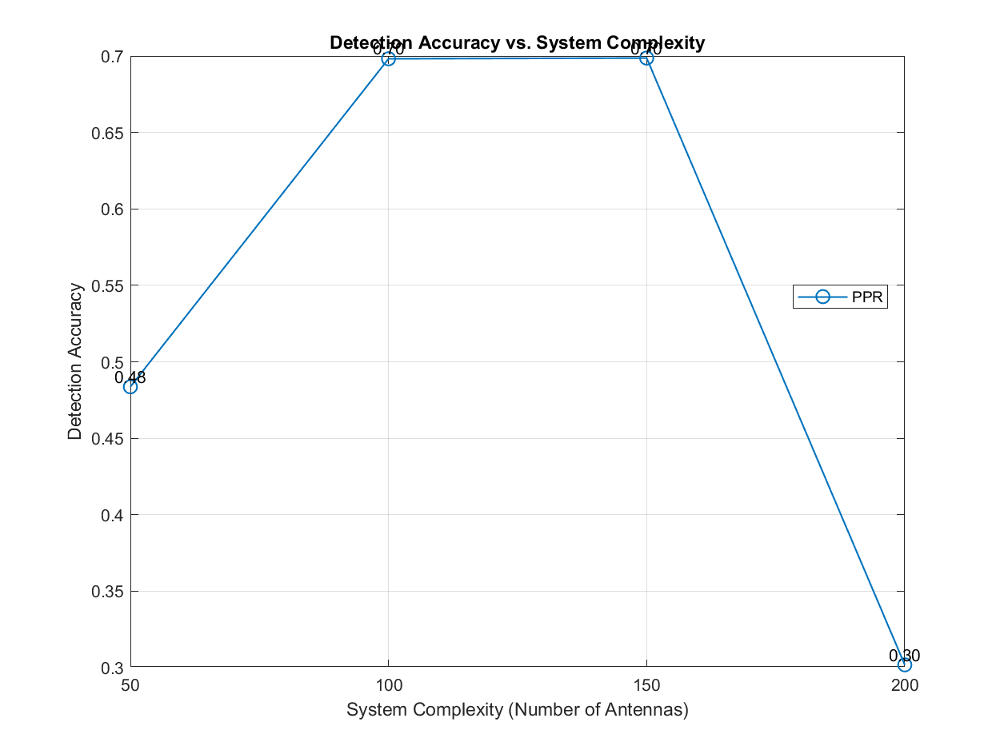
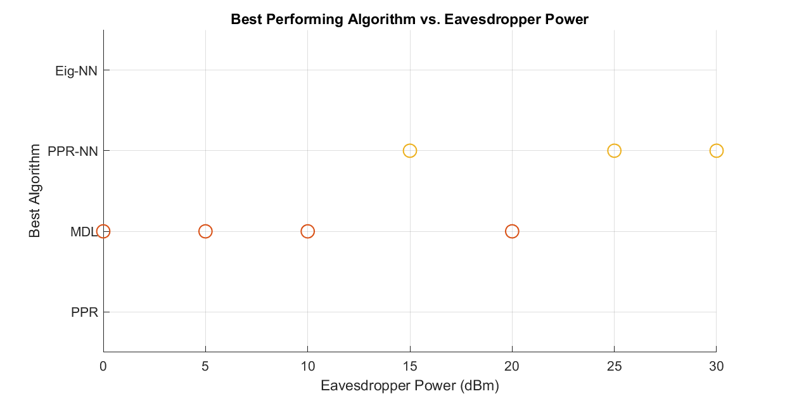
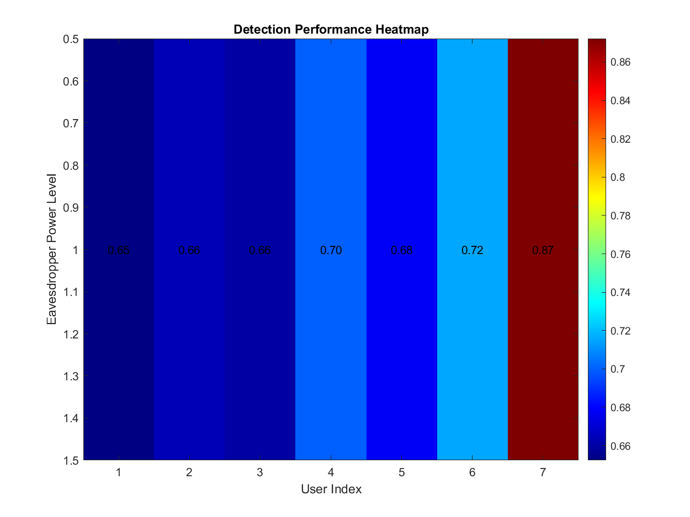
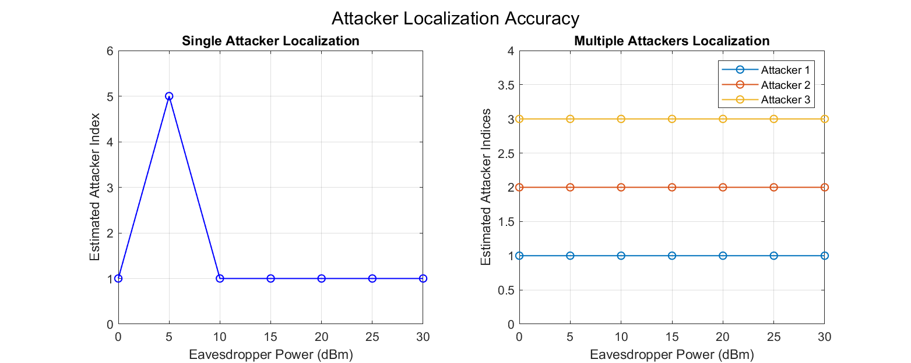

# Wireless Security Simulation Toolkit (WSST)

## Overview

The Wireless Security Simulation Toolkit (WSST) is a MATLAB-based library for simulating and analyzing Pilot Spoofing Attacks (PSA) in massive MIMO systems. It provides a comprehensive set of tools for channel modeling, signal processing, attack simulation, and detection using both traditional methods and machine learning approaches.

## Features

- Channel modeling for massive MIMO systems
- Generation of orthogonal training sequences
- Simulation of Pilot Spoofing Attacks
- Implementation of various PSA detection methods:
  - Pilot Pollution Ratio (PPR)
  - Minimum Description Length (MDL)
  - Neural Network-based detection
- Performance analysis and visualization tools

## Installation

1. Clone this repository or download the source code.
2. Add the WSST directory and its subdirectories to your MATLAB path:

```matlab
addpath(genpath('path/to/WSST'));
```

Alternatively, you can run the `setup.m` script to automatically set up the paths.

## Usage

Here's a basic example of how to use WSST:

```matlab
% Set parameters
M = 100;  % Number of BS antennas
K = 8;    % Number of users
tau = 16; % Training sequence length
% ... (set other parameters)

% Generate dataset
[X_feature_PPR, X_feature_Eig, y_label] = generateDataset(M, K, tau, gridSize, nbLoc, nbChanReal, P_ED);

% Train neural network models
trainAndSaveNNModels(X_feature_PPR, X_feature_Eig, y_label);

% Perform attack detection
[detAcc_PPR, detAcc_MDL, detAcc_PPR_NN, detAcc_Eig_NN] = detectMultipleAttackers(X_feature_PPR, X_feature_Eig, y_label, P_ED, P_ED_dBm, nbLoc, nbChanReal);

% Visualize results
plotDetectionAccuracy(P_ED_dBm, detAcc_PPR, detAcc_MDL, detAcc_PPR_NN, detAcc_Eig_NN);
```

For more detailed examples, please refer to the `examples` directory.

## Simulation Results

The WSST toolkit generates various plots to visualize the simulation results and performance metrics.

### Detection Accuracy


This plot shows the detection accuracy of different methods (PPR, MDL, PPR-NN, Eig-NN) across different eavesdropper power levels.

### Error Rates


This plot displays the false positive rate (FPR) and false negative rate (FNR) of PPR-NN and Eig-NN methods.

### Execution Times


This plot visualizes the execution times of different stages of the simulation (training, detection, localization).

### Accuracy vs. Complexity


This plot shows the detection accuracy of different methods against the system complexity (number of antennas).

### Best Algorithm


This plot identifies and displays the best performing algorithm for each power level.

### Detection Heatmap


This heatmap visualizes the detection accuracy of the PPR-NN method.

### Localization Accuracy


This plot shows the localization accuracy for single and multiple attacker scenarios.

These plots provide valuable insights into the performance and behavior of the PSA detection and localization methods.

## Directory Structure

```
.
├── AccuracyVsComplexity.png
├── BestAlgorithm.png
├── create_structure.sh
├── DetectionAccuracy.png
├── DetectionHeatmap.png
├── docs
│   ├── api
│   │   ├── attack.md
│   │   ├── channel.md
│   │   ├── data.md
│   │   ├── detection.md
│   │   ├── ml.md
│   │   └── signal.md
│   ├── examples
│   │   ├── advancedDetection.md
│   │   └── basicSimulation.md
│   └── gettingStarted.md
├── ErrorRates.png
├── examples
│   ├── advancedDetection.m
│   └── basicSimulation.m
├── ExecutionTimes.png
├── LICENSE
├── LocalizationAccuracy.png
├── main.asv
├── main.m
├── README.md
├── setup.m
├── src
│   ├── attack
│   │   ├── calculatePPR.m
│   │   └── simulatePSA.m
│   ├── channel
│   │   ├── calculatePathLoss.m
│   │   ├── generateEDChannel.m
│   │   ├── generatePositions.m
│   │   └── generateUEChannels.m
│   ├── data
│   │   ├── balanceDataset.m
│   │   └── generateDataset.m
│   ├── detection
│   │   ├── calculateEigenvalues.m
│   │   ├── calculateMDL.m
│   │   ├── detectMultipleAttackers.m
│   │   ├── detectPSA.m
│   │   ├── detectPSA_MDL.m
│   │   └── detectPSA_PPR.m
│   ├── localization
│   │   ├── locateMultipleAttackers.m
│   │   └── locateSingleAttacker.m
│   ├── ml
│   │   ├── defineModelArchitecture.m
│   │   ├── ensemblePSADetection.m
│   │   ├── gradientBoostingPSADetection.m
│   │   ├── lstmPSADetection.m
│   │   ├── randomForestPSADetection.m
│   │   ├── svmPSADetection.m
│   │   ├── trainAllModels.m
│   │   └── trainAndSaveNNModels.m
│   ├── signal
│   │   ├── generateNoise.m
│   │   └── generateTrainingSequence.m
│   └── utils
│       ├── addGaussianNoise.m
│       ├── calculateErrorRates.m
│       ├── removeExtremelyLowVarianceFeatures.m
│       ├── removeZeroFeatures.m
│       └── selectBestAlgorithm.m
├── tests
│   ├── testAttack.m
│   ├── testAttackSimulation.m
│   ├── testChannelGeneration.m
│   ├── testChannel.m
│   ├── testDataGeneration.m
│   ├── testDetection.m
│   ├── testDetectionMethods.m
│   ├── testNNTraining.m
│   └── testSignal.m
├── trainedNet_Eig.mat
├── trainedNet_PPR.mat
└── visualization
    ├── plotAccuracyVsComplexity.m
    ├── plotBestAlgorithm.m
    ├── plotDetectionAccuracy.m
    ├── plotErrorRates.m
    ├── plotExecutionTime.m
    ├── plotHeatmap.m
    ├── plotLocalizationAccuracy.m
    ├── plotMDLHistogram.m
    ├── plotReceivedSignal.m
    ├── visualizeNetworkTopology.m
    └── visualizePPRDistribution.m
```

The WSST toolkit includes the following main directories:

- `src/`: Source code for all WSST functions, organized into subdirectories based on functionality:
  - `channel/`: Channel modeling functions
  - `signal/`: Signal generation functions
  - `attack/`: PSA simulation functions
  - `detection/`: PSA detection functions
  - `localization/`: Attacker localization functions
  - `utils/`: Utility functions
  - `data/`: Data generation functions
  - `ml/`: Machine learning functions
- `docs/`: Documentation, including API reference and example usage guides
- `examples/`: Example scripts demonstrating WSST usage
- `tests/`: Unit tests for WSST functions
- `visualization/`: Plotting and visualization functions

The toolkit also includes pre-generated images (`AccuracyVsComplexity.png`, `BestAlgorithm.png`, etc.), trained neural network models (`trainedNet_Eig.mat`, `trainedNet_PPR.mat`), and main simulation scripts (`main.m`, `main.asv`).

## Contributing

Contributions to WSST are welcome! Please refer to the contributing guidelines for more information.

## License

This project is licensed under the MIT License - see the LICENSE file for details.

## Contact

For any queries or suggestions, please open an issue on the GitHub repository.