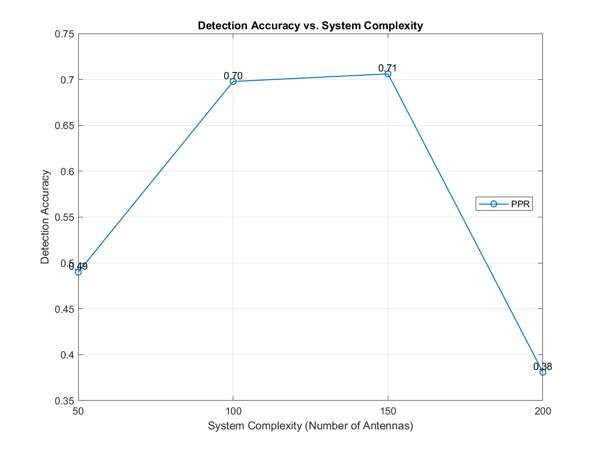
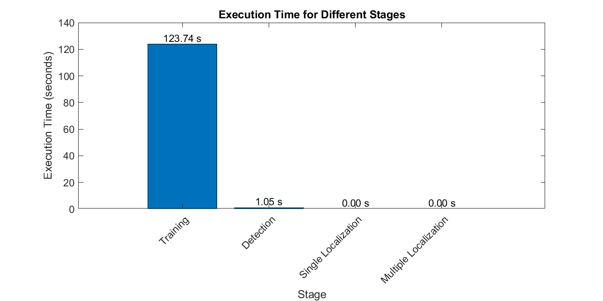
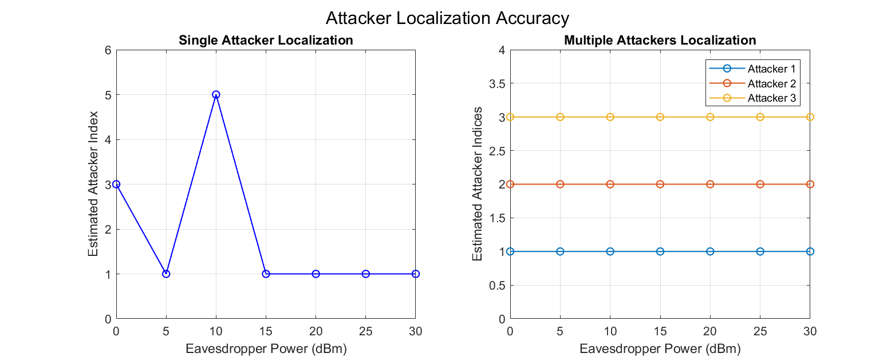
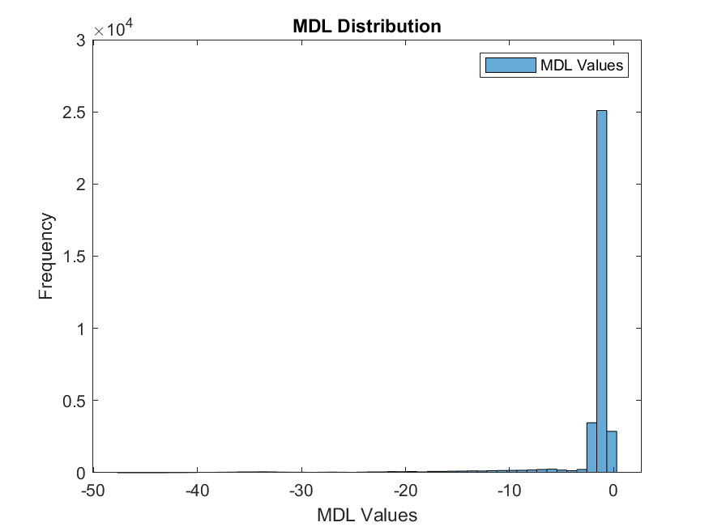
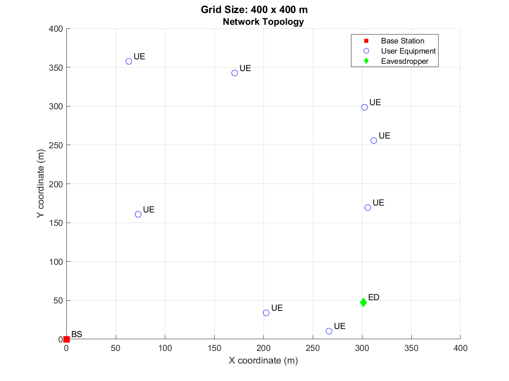
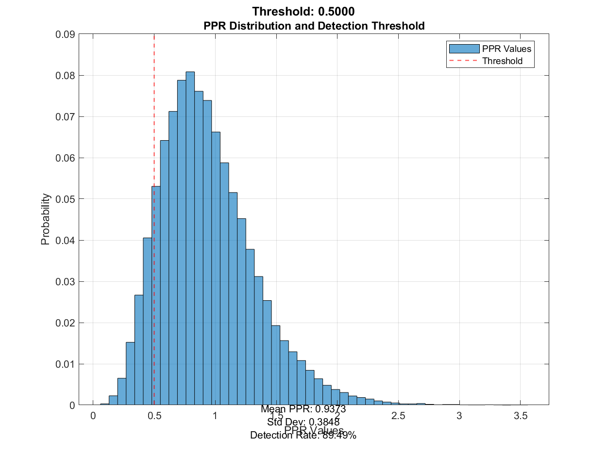
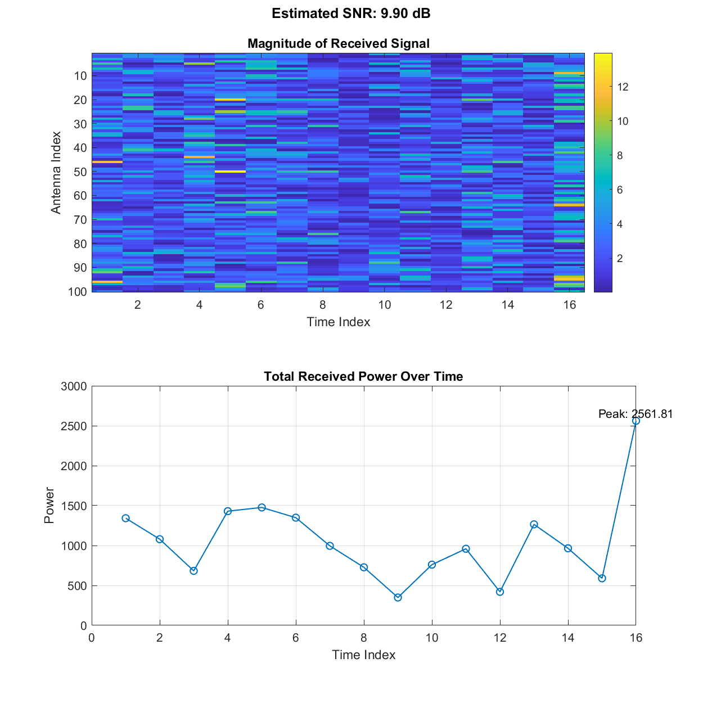

# Wireless Security Simulation Toolkit (WSST)

## Overview

The Wireless Security Simulation Toolkit (WSST) is a MATLAB-based library for simulating and analyzing Pilot Spoofing Attacks (PSA) in massive MIMO systems. It provides a comprehensive set of tools for channel modeling, signal processing, attack simulation, and detection using both traditional methods and machine learning approaches.

## Features

- Channel modeling for massive MIMO systems
- Generation of orthogonal training sequences
- Simulation of Pilot Spoofing Attacks
- Implementation of various PSA detection methods:
  - Pilot Pollution Ratio (PPR)
  - Minimum Description Length (MDL)
  - Neural Network-based detection
- Performance analysis and visualization tools

## Installation

1. Clone this repository or download the source code.
2. Add the WSST directory and its subdirectories to your MATLAB path:

```matlab
addpath(genpath('path/to/WSST'));
```

Alternatively, you can run the `setup.m` script to automatically set up the paths.

## Usage

Here's a basic example of how to use WSST:

```matlab
% Set parameters
M = 100;  % Number of BS antennas
K = 8;    % Number of users
tau = 16; % Training sequence length
% ... (set other parameters)

% Generate dataset
[X_feature_PPR, X_feature_Eig, y_label] = generateDataset(M, K, tau, gridSize, nbLoc, nbChanReal, P_ED);

% Train neural network models
trainAndSaveNNModels(X_feature_PPR, X_feature_Eig, y_label);

% Perform attack detection
[detAcc_PPR, detAcc_MDL, detAcc_PPR_NN, detAcc_Eig_NN] = detectMultipleAttackers(X_feature_PPR, X_feature_Eig, y_label, P_ED, P_ED_dBm, nbLoc, nbChanReal);

% Visualize results
plotDetectionAccuracy(P_ED_dBm, detAcc_PPR, detAcc_MDL, detAcc_PPR_NN, detAcc_Eig_NN);
```

For more detailed examples, please refer to the `examples` directory.

## Simulation Results

The WSST toolkit generates various plots to visualize the simulation results and performance metrics. Here's a description of each plot:

### Accuracy vs. Complexity

This plot shows the detection accuracy of different methods (PPR, MDL, PPR-NN, Eig-NN) against the system complexity, represented by the number of base station antennas. It helps evaluate the trade-off between detection performance and system complexity.

### Best Algorithm

This plot identifies and displays the best performing algorithm (PPR, MDL, PPR-NN, or Eig-NN) for each eavesdropper power level. It helps determine the most suitable detection method under different attack scenarios.

### Detection Accuracy

This plot shows the detection accuracy of different methods (PPR, MDL, PPR-NN, Eig-NN) across different eavesdropper power levels. It provides an overview of the detection performance of each method under varying attack strengths.

### Detection Heatmap

This heatmap visualizes the detection accuracy of the PPR-NN method for different combinations of base station antennas and eavesdropper power levels. It offers a more detailed view of the PPR-NN performance across different system configurations.

### Error Rates

This plot displays the false positive rate (FPR) and false negative rate (FNR) of the PPR-NN and Eig-NN methods across different eavesdropper power levels. It helps assess the reliability of these detection methods in terms of minimizing false alarms and missed detections.

### Execution Times

This plot visualizes the execution times of different stages of the simulation, including training, detection, and localization. It provides insights into the computational efficiency of the WSST toolkit and helps identify potential bottlenecks.

### Localization Accuracy

This plot shows the localization accuracy for single and multiple attacker scenarios. It demonstrates the ability of the WSST toolkit to estimate the positions of the attackers based on the received signals at the base station.

### MDL Histogram

This histogram displays the distribution of Minimum Description Length (MDL) values calculated from the received signals. It also shows the detection threshold used to distinguish between the presence and absence of attacks based on the MDL values.

### Network Topology

This plot visualizes the spatial arrangement of the base station, user equipment, and eavesdropper in the simulated network. It provides a visual representation of the system layout and helps understand the relative positions of the network elements.

### PPR Distribution

This plot shows the distribution of Pilot Pollution Ratio (PPR) values calculated from the received signals. It also displays the detection threshold used to differentiate between legitimate and malicious pilot signals based on the PPR values.

### Received Signal Visualization

This plot visualizes the magnitude of the received signal at the base station over time and across different antennas. It helps analyze the characteristics of the received signal and identify any abnormalities or patterns indicative of a pilot spoofing attack.

These plots provide comprehensive insights into the performance, behavior, and efficiency of the PSA detection and localization methods implemented in the WSST toolkit.

## Directory Structure

```
.
├── AccuracyVsComplexity.png
├── BestAlgorithm.png
├── create_structure.sh
├── DetectionAccuracy.png
├── DetectionHeatmap.png
├── docs
│   ├── api
│   │   ├── attack.md
│   │   ├── channel.md
│   │   ├── data.md
│   │   ├── detection.md
│   │   ├── ml.md
│   │   └── signal.md
│   ├── examples
│   │   ├── advancedDetection.md
│   │   └── basicSimulation.md
│   └── gettingStarted.md
├── ErrorRates.png
├── examples
│   ├── advancedDetection.m
│   └── basicSimulation.m
├── ExecutionTimes.png
├── LICENSE
├── LocalizationAccuracy.png
├── main.asv
├── main.m
├── MDLHistogram.png
├── NetworkTopology.png
├── PPRDistribution.png
├── README.md
├── ReceivedSignalVisualization.png
├── setup.m
├── src
│   ├── attack
│   │   ├── calculatePPR.m
│   │   └── simulatePSA.m
│   ├── channel
│   │   ├── calculatePathLoss.m
│   │   ├── generateEDChannel.m
│   │   ├── generatePositions.m
│   │   └── generateUEChannels.m
│   ├── data
│   │   ├── balanceDataset.m
│   │   └── generateDataset.m
│   ├── detection
│   │   ├── calculateEigenvalues.m
│   │   ├── calculateMDL.m
│   │   ├── detectMultipleAttackers.m
│   │   ├── detectPSA.m
│   │   ├── detectPSA_MDL.m
│   │   └── detectPSA_PPR.m
│   ├── localization
│   │   ├── locateMultipleAttackers.m
│   │   └── locateSingleAttacker.m
│   ├── ml
│   │   ├── defineModelArchitecture.m
│   │   ├── ensemblePSADetection.m
│   │   ├── gradientBoostingPSADetection.m
│   │   ├── lstmPSADetection.m
│   │   ├── randomForestPSADetection.m
│   │   ├── svmPSADetection.m
│   │   ├── trainAllModels.m
│   │   └── trainAndSaveNNModels.m
│   ├── signal
│   │   ├── generateNoise.m
│   │   └── generateTrainingSequence.m
│   └── utils
│       ├── addGaussianNoise.m
│       ├── calculateErrorRates.m
│       ├── removeExtremelyLowVarianceFeatures.m
│       ├── removeZeroFeatures.m
│       └── selectBestAlgorithm.m
├── tests
│   ├── testAttack.m
│   ├── testAttackSimulation.m
│   ├── testChannelGeneration.m
│   ├── testChannel.m
│   ├── testDataGeneration.m
│   ├── testDetection.m
│   ├── testDetectionMethods.m
│   ├── testNNTraining.m
│   └── testSignal.m
├── trainedNet_Eig.mat
├── trainedNet_PPR.mat
└── visualization
    ├── plotAccuracyVsComplexity.m
    ├── plotBestAlgorithm.m
    ├── plotDetectionAccuracy.m
    ├── plotErrorRates.m
    ├── plotExecutionTime.m
    ├── plotHeatmap.m
    ├── plotLocalizationAccuracy.m
    ├── plotMDLHistogram.m
    ├── plotReceivedSignal.m
    ├── visualizeNetworkTopology.m
    └── visualizePPRDistribution.m
```

The WSST toolkit includes the following main directories:

- `src/`: Source code for all WSST functions, organized into subdirectories based on functionality:
  - `channel/`: Channel modeling functions
  - `signal/`: Signal generation functions
  - `attack/`: PSA simulation functions
  - `detection/`: PSA detection functions
  - `localization/`: Attacker localization functions
  - `utils/`: Utility functions
  - `data/`: Data generation functions
  - `ml/`: Machine learning functions
- `docs/`: Documentation, including API reference and example usage guides
- `examples/`: Example scripts demonstrating WSST usage
- `tests/`: Unit tests for WSST functions
- `visualization/`: Plotting and visualization functions

The toolkit also includes pre-generated images (`AccuracyVsComplexity.png`, `BestAlgorithm.png`, etc.), trained neural network models (`trainedNet_Eig.mat`, `trainedNet_PPR.mat`), and main simulation scripts (`main.m`, `main.asv`).

## Contributing

Contributions to WSST are welcome! Please refer to the contributing guidelines for more information.

## License

This project is licensed under the MIT License - see the LICENSE file for details.

## Contact

For any queries or suggestions, please open an issue on the GitHub repository.