# 蜂窝大规模 MIMO 系统中导航欺骗攻击检测框架

## 1. 研究背景

在蜂窝大规模 MIMO（Multiple-Input Multiple-Output）系统中，导航欺骗攻击（Pilot Spoofing Attack, PSA）是一种严重的安全威胁。攻击者通过模仿合法用户的导频信号，可能会显著降低系统性能，甚至导致信息泄露。本研究旨在开发和评估能够有效识别受 PSA 攻击用户的方法，结合传统技术和机器学习方法，以提高大规模 MIMO 系统的安全性。

## 2. 系统模型

在算法创新角度，基于DBNet的OCR领域可以考虑以下几种创新思路：

### 1. **基于自适应采样策略的文本区域增强**:

   - **背景**: DBNet在文本区域检测时依赖固定的尺度和特征抽取方式，在处理复杂背景或多尺度文本时可能表现不佳。
   - **创新点**: 提出一种自适应采样策略，根据输入图像的内容动态调整文本区域的采样密度和大小。通过引入注意力机制或强化学习方法，模型可以自动学习如何更有效地在复杂背景中定位文本区域，从而提高检测的准确性和鲁棒性。

### 2. **多层级特征融合的边缘检测与文本识别联合优化**:

   - **背景**: 现有的OCR算法通常将文本检测和文本识别分为两个独立的阶段，这可能会导致信息丢失或不匹配。
   - **创新点**: 提出一种多层级特征融合方法，将边缘检测与文本识别联合优化。在文本检测过程中，不仅仅依赖最后一层特征图，而是将不同层级的特征（如低层的边缘信息和高层的语义信息）进行融合，并通过联合损失函数优化，使得检测与识别过程协同进行，从而提高整体的OCR效果。

### 3. **基于图神经网络的文本结构化识别**:

   - **背景**: 对于复杂布局的文本（如表格、广告、或者多列文章），传统的DBNet难以捕捉文本间的结构化关系。
   - **创新点**: 引入图神经网络（GNN）来处理文本区域的结构化信息。首先利用DBNet检测文本区域，然后构建一个文本区域的图结构，其中节点表示检测到的文本块，边表示文本块之间的空间或语义关系。通过GNN传播和聚合节点信息，模型可以更好地理解复杂布局中的文本关系，并提升文本识别的整体效果。

### 4. **自监督学习与弱监督结合的轻量化文本检测**:

   - **背景**: 训练一个高效的OCR模型通常需要大量标注数据，这在实际场景中可能难以获得。
   - **创新点**: 提出一种结合自监督学习与弱监督学习的轻量化文本检测方法。首先通过自监督预训练来学习图像的基本特征，然后在少量标注数据的指导下，利用弱监督学习技术优化DBNet模型，使其能够在数据稀缺的情况下仍保持较好的检测性能。此方法不仅减少了对标注数据的依赖，还能通过自监督学习提高模型的泛化能力。

### 5. **基于元学习的快速适应文本检测**:

   - **背景**: OCR模型在面对不同语言、字体或文本风格时往往需要重新训练或微调，代价较高。
   - **创新点**: 引入元学习（Meta-Learning）方法，使得DBNet模型能够快速适应不同的文本检测任务。通过在训练过程中学习“如何学习”，模型可以在接收到新任务（如新的语言或字体）时，通过少量数据迅速进行自我调整和优化，从而在不同任务之间实现快速迁移和适应。

这些创新思路侧重于从算法层面增强DBNet模型的检测和识别能力，提升其在复杂场景下的表现，同时注重模型的泛化能力与轻量化设计，以应对不同应用场景下的挑战。

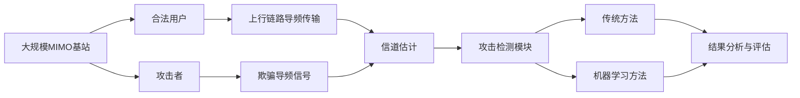


## 3. 主要模块

### 3.1 数据生成 (`generateDataset` 函数)

模拟大规模 MIMO 系统中的 PSA 场景：

- 输入参数：
  - `M`: 基站天线数量（大规模 MIMO 特征）
  - `K`: 用户设备数量
  - `tau`: 导频序列长度
  - `gridSize`: 小区尺寸
  - `nbLoc`: 位置实现次数
  - `nbChanReal`: 信道实现次数
  - `P_ED`: 攻击者发射功率范围

- 输出：
  - `X_feature_PPR`: 基于导频功率比（PPR）的特征
  - `X_feature_Eig`: 基于信道协方差矩阵特征值的特征
  - `y_label`: 攻击标签

实现细节：

1. 生成基站、合法用户和攻击者的空间分布
2. 模拟大规模 MIMO 信道，包括大尺度衰落和小尺度衰落
3. 生成合法用户和攻击者的导频序列
4. 计算接收信号并提取 PPR 和特征值特征
5. 生成对应的攻击标签

### 3.2 攻击检测方法

#### 3.2.1 传统方法

1. PPR（Pilot Power Ratio）方法 (`implementPPRMethod` 函数)
   - 基于导频信号功率比检测异常
   - 利用大规模 MIMO 系统中用户信道的正交性原理

2. MDL（Minimum Description Length）方法 (`implementMDLMethod` 函数)
   - 基于信道协方差矩阵的特征值分析
   - 利用 MDL 准则估计信号子空间维度，检测异常增加的维度

#### 3.2.2 机器学习方法

1. PPR-NN：基于 PPR 特征的神经网络
2. Eig-NN：基于特征值特征的神经网络

这两个神经网络模型在 `trainAndSaveNNModels` 函数中定义和训练：

- 网络结构：多层感知器（MLP）
- 优化器：Adam
- 损失函数：二元交叉熵
- 正则化：Dropout 和早停

### 3.3 攻击者定位

1. 单攻击者定位 (`locateSingleAttacker` 函数)
2. 多攻击者定位 (`locateMultipleAttackers` 函数)

这些函数利用 PPR 特征估计攻击者的可能位置。

### 3.4 性能评估

1. 检测准确率 (`plotDetectionAccuracy` 函数)
   - 比较不同方法在各种攻击功率下的检测准确率

2. 错误率分析 (`calculateErrorRates`, `plotErrorRates` 函数)
   - 计算并可视化假阳性率（FPR）和假阴性率（FNR）

3. 定位准确率 (`plotLocalizationAccuracy` 函数)
   - 评估攻击者位置估计的准确性

4. 复杂度分析 (`plotAccuracyVsComplexity` 函数)
   - 研究系统参数（如天线数量）对检测性能的影响

5. 执行时间分析 (`plotExecutionTime` 函数)
   - 比较各方法的计算效率

## 4. 使用说明

1. 在 MATLAB 环境中设置参数：

   ```matlab
   M = 100;  % 基站天线数量
   K = 8;    % 用户数量
   tau = 16; % 导频序列长度
   % ... 设置其他参数
   ```

2. 运行主函数：

   ```matlab
   main()
   ```

3. 分析生成的图表和性能指标

4. 根据需要调整参数或方法，重新运行进行对比分析

## 5. 关键发现与结论

（在实际运行后填写）

1. 传统方法（PPR 和 MDL）在低攻击功率下的表现
2. 机器学习方法（PPR-NN 和 Eig-NN）在复杂场景下的优势
3. 系统参数（如天线数量、用户数量）对检测性能的影响
4. 单攻击者和多攻击者场景下的检测和定位性能差异
5. 计算复杂度与检测性能之间的权衡

## 6. 未来工作方向

1. 集成更多先进的机器学习模型，如卷积神经网络（CNN）或递归神经网络（RNN）
2. 考虑更复杂的攻击模式，如智能自适应攻击
3. 将检测框架扩展到其他类型的物理层攻击
4. 研究实时检测和防御策略
5. 考虑将联邦学习等隐私保护技术整合到检测框架中

通过这个框架，我们可以全面评估和比较不同方法在检测蜂窝大规模 MIMO 系统中的导航欺骗攻击时的性能。这项研究不仅有助于提高系统安全性，还为未来 5G 和 6G 网络中的安全机制设计提供了宝贵的见解。


## 程序逻辑关系图

这个图将展示整个系统的主要组件及其之间的关系。

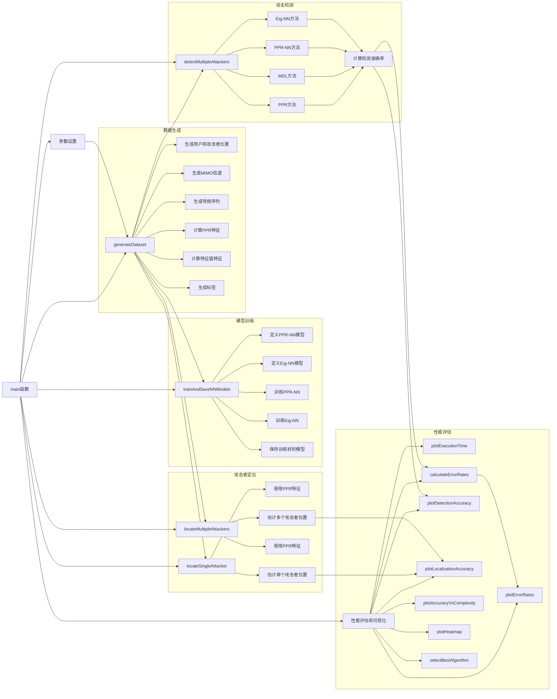

这个流程图展示了整个程序的逻辑关系：

1. **主函数（main）**：
   - 设置所有必要的参数。
   - 调用其他主要函数来执行各个任务。
   - 协调整个程序的流程。

2. **数据生成（generateDataset）**：
   - 生成模拟大规模 MIMO 系统的数据。
   - 创建用户和攻击者的位置分布。
   - 生成 MIMO 信道和导频序列。
   - 计算 PPR 和特征值特征。
   - 生成对应的攻击标签。

3. **模型训练（trainAndSaveNNModels）**：
   - 定义和训练两个神经网络模型：PPR-NN 和 Eig-NN。
   - 使用生成的数据进行训练。
   - 保存训练好的模型供后续使用。

4. **攻击检测（detectMultipleAttackers）**：
   - 实现四种检测方法：PPR、MDL、PPR-NN 和 Eig-NN。
   - 对每种方法计算检测准确率。
   - 为后续的性能评估提供结果。

5. **攻击者定位**：
   - 单攻击者定位（locateSingleAttacker）：估计单个攻击者的位置。
   - 多攻击者定位（locateMultipleAttackers）：同时估计多个攻击者的位置。

6. **性能评估和可视化**：
   - 执行时间分析（plotExecutionTime）
   - 错误率计算和可视化（calculateErrorRates, plotErrorRates）
   - 检测准确率分析（plotDetectionAccuracy）
   - 定位准确率分析（plotLocalizationAccuracy）
   - 复杂度分析（plotAccuracyVsComplexity）
   - 热图分析（plotHeatmap）
   - 最佳算法选择（selectBestAlgorithm）

这个流程图清楚地展示了各个组件之间的关系和数据流向。主函数作为中心控制单元，协调其他所有功能模块的运行。数据从生成开始，经过模型训练和攻击检测，最后进行全面的性能评估和可视化。这种模块化的设计使得系统具有良好的可扩展性和灵活性，便于未来加入新的检测方法或评估指标。


## 详细解释数据生成的逻辑

数据生成是整个系统的基础，对于模拟蜂窝大规模 MIMO 系统中的导航欺骗攻击至关重要。让我们深入了解 `generateDataset` 函数的具体实现逻辑。

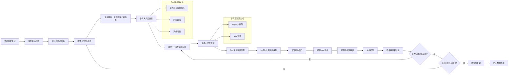

现在，让我详细解释数据生成的每个步骤：

1. **设置系统参数**
   - 输入参数包括：基站天线数量 (M)、用户数量 (K)、导频序列长度 (tau)、小区尺寸 (gridSize)、场景数量 (nbLoc)、每个场景的信道实现次数 (nbChanReal)、攻击者功率范围 (P_ED)。

2. **初始化数据结构**
   - 创建用于存储 PPR 特征 (X_feature_PPR)、特征值特征 (X_feature_Eig) 和标签 (y_label) 的数组。

3. **循环：不同的场景**
   - 每个场景代表一种不同的用户和攻击者空间分布。

4. **生成基站、用户和攻击者位置**
   - 在定义的小区范围内随机生成位置坐标。
   - 基站通常位于小区中心。

5. **计算大尺度衰落**
   - 包括距离相关的路径损耗、阴影衰落和天线增益。
   - 使用适合蜂窝网络的路径损耗模型，如 COST231-Hata 模型。

6. **循环：不同的信道实现**
   - 每个信道实现代表一个独立的小尺度衰落实例。

7. **生成小尺度衰落**
   - 对于非视线（NLOS）情况，使用 Rayleigh 衰落模型。
   - 对于视线（LOS）情况，可以考虑使用 Rice 衰落模型。

8. **生成用户导频序列**
   - 使用正交或近正交序列，如 Zadoff-Chu 序列。

9. **生成攻击者导频序列**
   - 模拟攻击者复制目标用户的导频序列。

10. **计算接收信号**
    - 综合考虑用户信号、攻击者信号和噪声。
    - Y = √(P_u) * H_u * x_u + √(P_a) * H_a * x_a + N
      其中，P_u 和 P_a 分别是用户和攻击者的发射功率，H_u 和 H_a 是相应的信道矩阵，x_u 和 x_a 是导频序列，N 是噪声。

11. **提取 PPR 特征**
    - 计算每个用户的导频功率比。
    - PPR_k = ||Y * x_k^H||^2 / (||x_k||^2 * ||Y||^2)

12. **提取特征值特征**
    - 计算接收信号协方差矩阵的特征值。
    - R = Y * Y^H
    - [V, D] = eig(R)

13. **生成标签**
    - 根据是否存在攻击生成二进制标签。
    - 0 表示无攻击，1 表示有攻击。

14. **存储特征和标签**
    - 将计算得到的特征和对应的标签存储到预定义的数组中。

15. **数据后处理**
    - 对生成的数据进行归一化或标准化处理。
    - 可能的话，进行特征选择或降维。

16. **结束数据生成**
    - 返回生成的特征矩阵和标签数组。

这个数据生成过程模拟了真实的蜂窝大规模 MIMO 系统环境，包括合法用户和攻击者的信号传播特性。通过改变不同的参数，如攻击者的功率、位置或攻击策略，我们可以生成各种攻击场景的数据，这对于全面评估不同检测方法的性能至关重要。

生成的数据集包含了丰富的信息，不仅反映了正常用户的信道特性，还包含了攻击者引入的异常模式。这为后续的机器学习模型训练和传统方法的应用提供了坚实的基础。


## 详细解释机器学习（ML）模型的训练逻辑

在这个系统中，我们主要使用神经网络来进行导航欺骗攻击的检测。让我们深入了解 `trainAndSaveNNModels` 函数的具体实现逻辑。

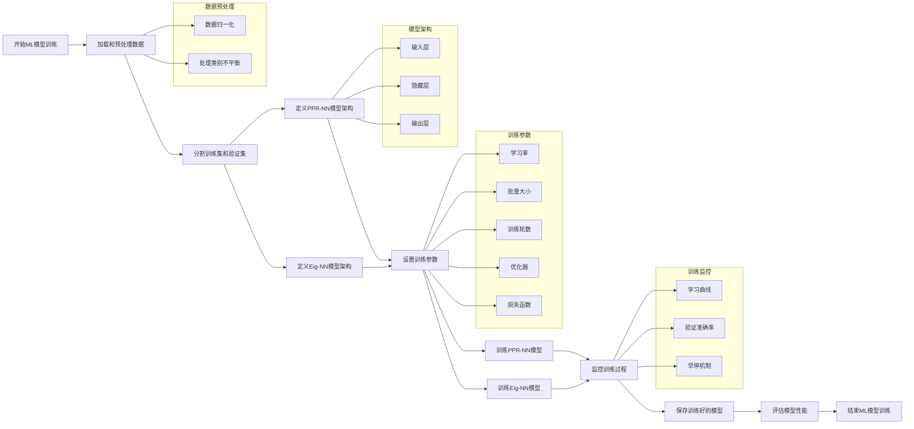

现在，让我详细解释ML模型训练的每个步骤：

1. **加载和预处理数据**

   - 从 `generateDataset` 函数获取生成的特征（X_feature_PPR, X_feature_Eig）和标签（y_label）。
   - 数据归一化：对特征进行标准化或归一化处理，确保所有特征在相同的尺度上。

   ```matlab
   X_feature_PPR_normalized = normalize(X_feature_PPR);
   X_feature_Eig_normalized = normalize(X_feature_Eig);
   ```

   - 处理类别不平衡：如果攻击样本和非攻击样本的比例不均衡，可以使用过采样、欠采样或调整类别权重的方法。

2. **分割训练集和验证集**

   - 通常按照 80%/20% 或 70%/30% 的比例分割数据。

   ```matlab
   [trainInd,valInd] = dividerand(numSamples, 0.8, 0.2);
   ```

3. **定义模型架构**
   为 PPR-NN 和 Eig-NN 定义相似但独立的神经网络结构：

   ```matlab
   layers = [
       featureInputLayer(numFeatures)
       fullyConnectedLayer(128)
       batchNormalizationLayer
       reluLayer
       dropoutLayer(0.5)
       fullyConnectedLayer(64)
       batchNormalizationLayer
       reluLayer
       dropoutLayer(0.3)
       fullyConnectedLayer(32)
       reluLayer
       fullyConnectedLayer(1)
       sigmoidLayer
   ];
   ```

4. **设置训练参数**
   使用 `trainingOptions` 函数设置参数：

   ```matlab
   options = trainingOptions('adam', ...
       'InitialLearnRate', 0.001, ...
       'MaxEpochs', 100, ...
       'MiniBatchSize', 64, ...
       'Shuffle', 'every-epoch', ...
       'ValidationFrequency', 30, ...
       'Plots', 'training-progress', ...
       'ValidationData', {XVal, YVal}, ...
       'ValidationPatience', 5);
   ```

5. **训练模型**
   分别训练 PPR-NN 和 Eig-NN 模型：

   ```matlab
   netPPR = trainNetwork(X_feature_PPR_train, y_train, layers, options);
   netEig = trainNetwork(X_feature_Eig_train, y_train, layers, options);
   ```

6. **监控训练过程**

   - 观察训练和验证损失曲线，检测过拟合。
   - 监控验证准确率的变化。
   - 使用早停机制防止过拟合。

7. **保存训练好的模型**

   ```matlab
   save('trainedNet_PPR.mat', 'netPPR');
   save('trainedNet_Eig.mat', 'netEig');
   ```

8. **评估模型性能**
   使用测试集或交叉验证来评估模型的泛化能力：

   ```matlab
   YPred_PPR = predict(netPPR, X_feature_PPR_test);
   YPred_Eig = predict(netEig, X_feature_Eig_test);
   accuracy_PPR = sum(round(YPred_PPR) == y_test) / numel(y_test);
   accuracy_Eig = sum(round(YPred_Eig) == y_test) / numel(y_test);
   ```

**关键考虑点：**

1. **特征选择**：PPR-NN 和 Eig-NN 使用不同的特征集，分别基于导频功率比和信道协方差矩阵的特征值。

2. **模型复杂度**：根据数据量和问题复杂度调整网络深度和宽度。对于此问题，中等规模的网络（如 3-4 层）通常足够。

3. **正则化**：使用 Dropout 和 Batch Normalization 来防止过拟合。

4. **学习率调度**：可以实施学习率衰减策略以提高训练稳定性和最终性能。

5. **类别平衡**：如果攻击样本较少，考虑使用类别权重或过采样技术。

6. **模型集成**：可以训练多个模型并进行集成，如简单平均或加权平均，以提高稳定性和性能。

这个训练过程旨在创建能够有效区分正常信号和受攻击信号的模型。通过使用两种不同的特征集（PPR 和特征值），我们可以捕捉攻击的不同方面，potentially提高检测的鲁棒性。训练完成后，这些模型将在 `detectMultipleAttackers` 函数中与传统方法一起使用，为系统提供全面的攻击检测能力。


## 详细解释每个图表的目的和内容含义

这些图表是评估和理解系统性能的关键工具。

1. 检测准确率图 (plotDetectionAccuracy)

目的：比较不同检测方法在各种攻击功率下的性能。

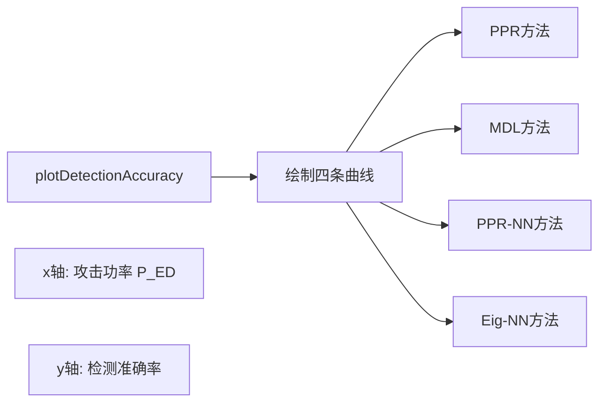

内容含义：

- 横轴表示攻击者的发射功率（dBm）。
- 纵轴表示检测准确率（0到1之间）。
- 每条曲线代表一种检测方法。
- 曲线的走势反映了方法对不同强度攻击的敏感度。
- 较高和较为平稳的曲线表示方法在各种攻击强度下都表现良好。

2. 错误率分析图 (plotErrorRates)

目的：详细分析各方法的假阳性率（FPR）和假阴性率（FNR）。

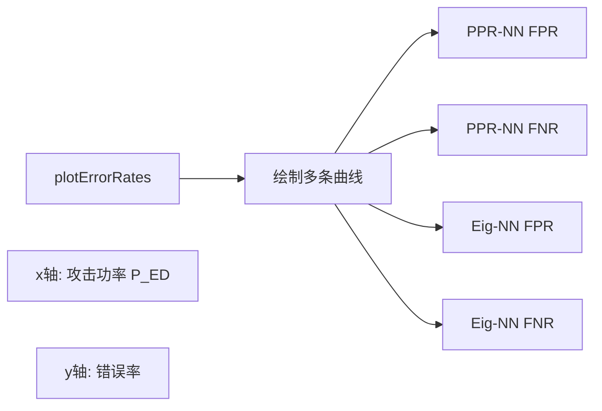

内容含义：

- 横轴表示攻击者的发射功率（dBm）。
- 纵轴表示错误率（0到1之间）。
- FPR曲线表示将正常用户误判为攻击者的比率。
- FNR曲线表示未能检测到实际攻击的比率。
- 理想情况下，两种错误率都应较低。
- 曲线的交叉点可能表示系统的最佳工作点。

3. 定位准确率图 (plotLocalizationAccuracy)

目的：评估系统定位攻击者的能力。

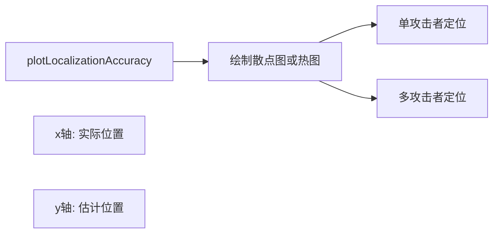

内容含义：

- 可能使用散点图，其中x轴是实际位置，y轴是估计位置。
- 点越接近对角线，表示定位越准确。
- 对于多攻击者情况，可能使用不同颜色区分不同的攻击者。
- 图中的分散程度反映了定位的精度和一致性。

4. 复杂度分析图 (plotAccuracyVsComplexity)

目的：研究系统复杂度（如天线数量）对检测性能的影响。

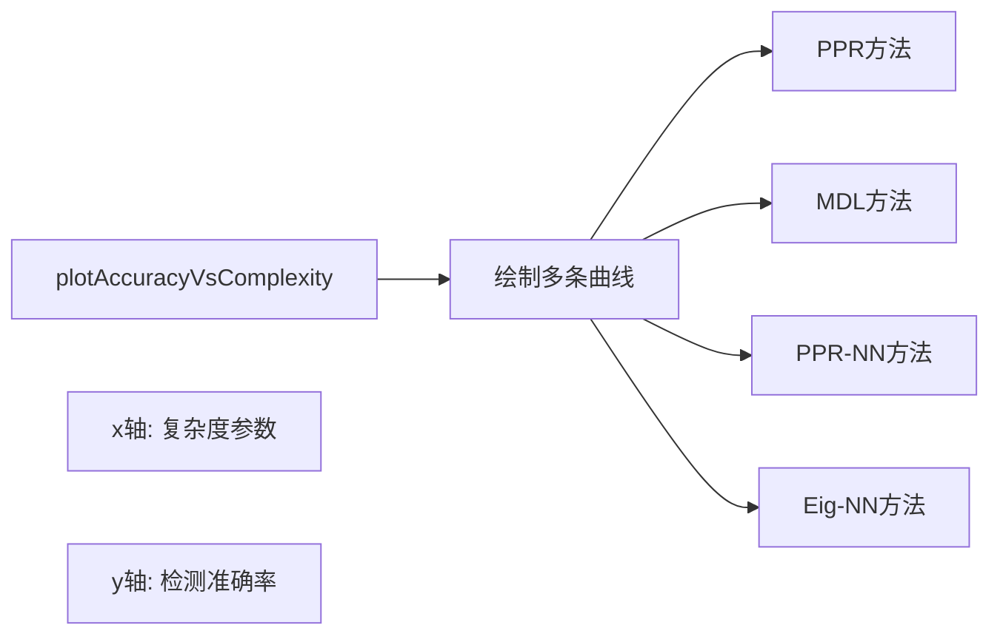

内容含义：

- 横轴可能表示天线数量或其他复杂度指标。
- 纵轴表示检测准确率。
- 曲线的上升趋势表明增加复杂度能提高性能。
- 曲线趋于平缓可能意味着达到了性能瓶颈。
- 不同方法的曲线比较可以显示哪种方法在不同复杂度下更有优势。

5. 执行时间分析图 (plotExecutionTime)

目的：比较各种方法的计算效率。

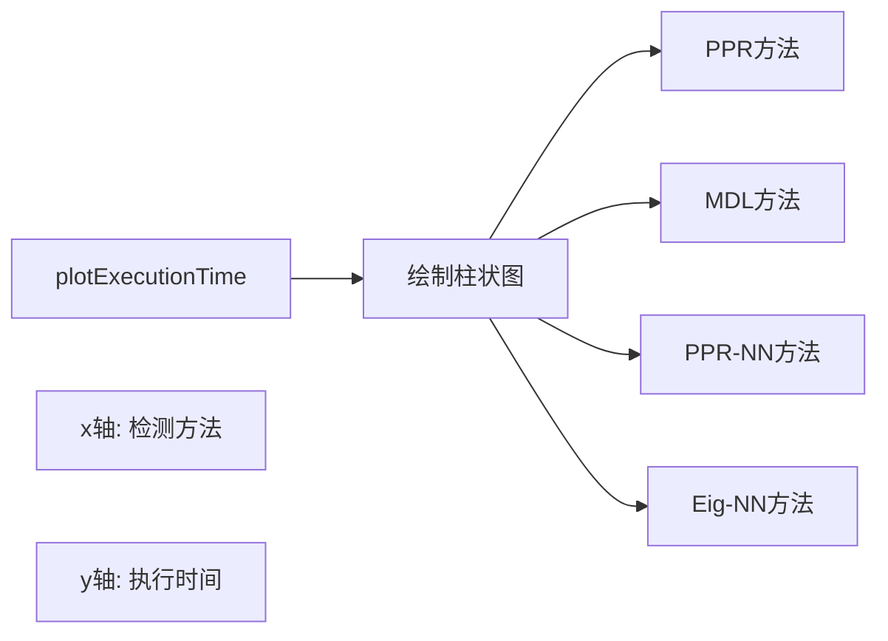

内容含义：

- 每个柱代表一种检测方法。
- 柱的高度表示平均执行时间。
- 可以直观比较不同方法的计算复杂度。
- 较短的柱表示方法更适合实时处理。

6. 热图 (plotHeatmap)

目的：可视化检测结果的空间分布。

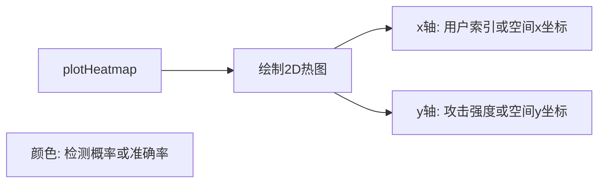

内容含义：

- 颜色深浅表示检测的置信度或准确率。
- 可以显示攻击检测在不同空间位置或用户上的表现。
- 热点区域可能表示特别容易受攻击的位置或用户。

7. ROC曲线 (可能作为plotErrorRates的一部分)

目的：评估检测器在不同决策阈值下的性能。

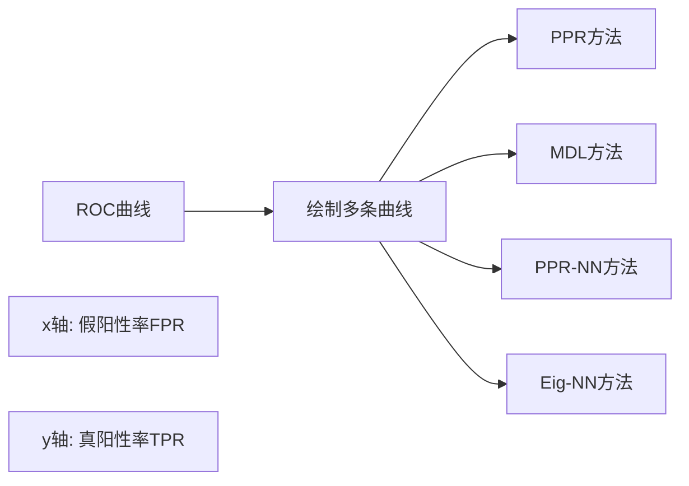

内容含义：

- 每条曲线代表一种检测方法。
- 曲线越接近左上角，表示方法性能越好。
- 曲线下面积（AUC）是性能的综合指标。
- 可以用于选择最佳操作点（权衡FPR和TPR）。

这些图表共同提供了系统性能的全面视图，涵盖了准确性、效率、鲁棒性和实用性等多个方面。通过分析这些图表，研究人员可以深入理解各种检测方法的优缺点，为改进现有方法和开发新方法提供指导。

